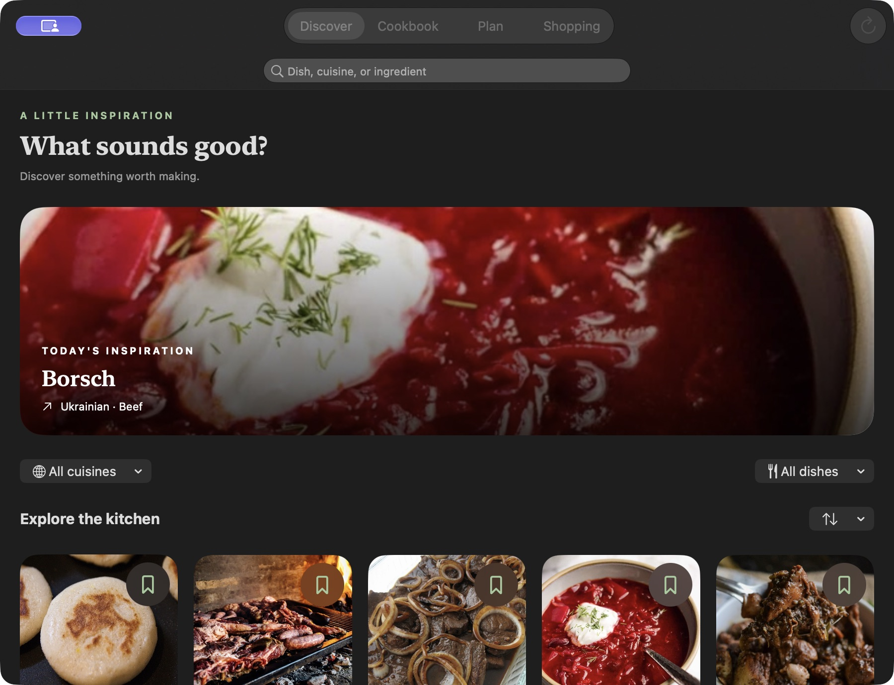
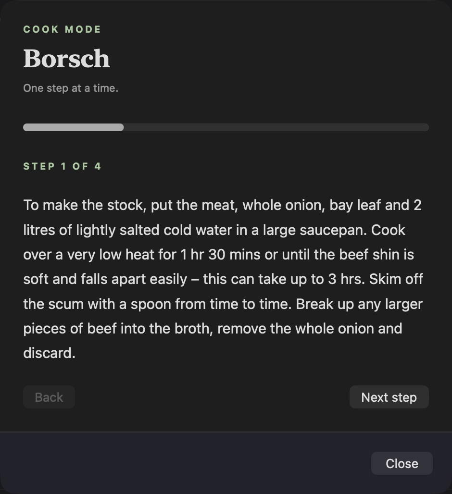

# Recipes

A personal kitchen companion for iPhone, iPad, and Mac. Discover dishes, build an offline cookbook, plan meals, collect ingredients, and keep your own cooking notes.

## A look inside





## What you can do

- Browse a photo-led catalogue with cuisine and dish filters. Search names, cuisines, categories, or ingredients.
- Save full recipe snapshots in a cookbook, with its own search. Saved directions and ingredients remain available offline.
- Read measured ingredients and source directions, open the original recipe or video, and share a recipe link.
- Follow one source instruction at a time in Cook mode; on iPhone the screen stays awake while that sheet is open.
- Plan a recipe for a date, browse weeks, reschedule, mark cooked, and undo. Cooking a planned meal from its detail or the planner records one event, with shared history and no duplicate count.
- Add ingredients to a persistent shopping list, add your own groceries, check items off, and share the remaining list. Repeated additions skip unchecked duplicates from the same recipe. Quantities from different recipes remain separate rather than being silently combined.
- Save private notes and track how often you make each recipe. Logging a cook does not overwrite an unsaved note draft.
- Refresh the public catalogue with bounded requests and cache successful results. A failed supplementary request does not discard successful results, and an unavailable service does not erase the cache or cookbook.

The original CloudFront catalogue hostname no longer resolves. The app now uses [TheMealDB](https://www.themealdb.com/api.php), including photos, ingredients, instructions, source links, and attribution. It loads a bounded discovery selection rather than claiming to contain the entire database. Search and filters operate on that selection; refresh can change it. No cooking times, nutrition, or serving quantities are invented.

## Run

Open `Recipes.xcodeproj` in Xcode, select the Recipes scheme, and choose an iOS simulator or My Mac. The project uses SwiftUI and SwiftData with no third-party dependencies. Targets: iOS 18.4+, macOS 15.4+, and the existing visionOS 2.4+ configuration. Current verification used Xcode 27.

```sh
xcodebuild -project Recipes.xcodeproj -scheme Recipes \
  -destination 'generic/platform=iOS Simulator' \
  -derivedDataPath .derivedData CODE_SIGNING_ALLOWED=NO build

xcodebuild -project Recipes.xcodeproj -scheme Recipes \
  -destination 'platform=macOS' -derivedDataPath .derivedData \
  -only-testing:RecipesTests CODE_SIGNING_ALLOWED=NO test
```

## Data and offline behavior

Favorites, plans, groceries, cooking events, and notes are stored locally in SwiftData. A saved recipe includes the full available source text. The public discovery catalogue is also cached in the app's Application Support directory after a successful load. Photos are remote and may show a native placeholder offline; the app does not claim to download a photo library. There are no accounts, sync, notifications, or external writes.

The existing Favorite model and recipe identifiers are retained. Its new snapshot field is nullable so existing records can migrate. Old catalogue favorites without snapshots remain retained as legacy IDs with an explanatory message; they cannot be reconstructed from the replacement API. The app never deletes the data store to recover from a migration failure.

TheMealDB's developer key `1` is used for this portfolio/educational project. Its API documentation requires a supporter key for a public App Store release. Review their current terms before distribution. The configured Mac sandbox entitlement permits outgoing recipe/image requests.

## Verification

Swift Testing covers legacy decoding, ingredient parsing, invalid identities/links, deduplication, cookbook snapshots and legacy favorite IDs, normalized plans, grocery/note persistence, cache loading, idempotent planned cooking, and chronological undo behavior. The UI-test target is the original scaffold; the checks do not claim App Store release readiness or automated visual coverage.
